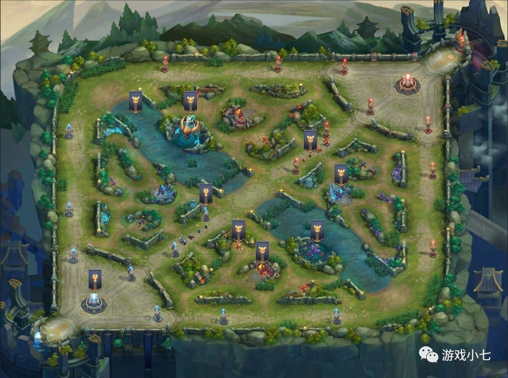

During the time I was in High school, I was addicted to a game called King of glory, a game like league and legend.(The basic gameplay across all game modes involve controlling a character with unique abilities to kill non-player characters and opponents to gain experience and gold, with experience used to unlock their character's abilities or further augment the ability's power, and gold used to purchase items at the shop (which change specific attributes depending on the item bought). Players then coordinate to knock down enemy's defensive structures called turrets, and victory is achieved by destroying the core building, located within the enemy team's base. Specific gameplay mechanics vary depending on the game mode chosen.) The change that I played this game is my friends. He was aking to download this game and play with him. He explained the game and how to play it. Afetr a couple month, I was really good at playing this game. And I found that the strategy and coorporation in this game are really important to lead you win. I started to learn how those teammates communicate during the game and the strategy in different situation. It really help me solving problem in different way. It also teach me how to be a leader. Analyze the battle and place a right order to teammates, help everyone know about teh situation.In that way, we can increase the prossibility to win the game. It is the same thing as we are in real life. Sometimes, game isn't a bad thing, it usually teach you something else you may not know in real life.
